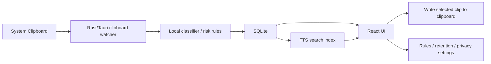

# Dev Clipboard Technical Plan

Last updated: 2026-06-29

## Purpose

Dev ClipboardのMVPは、開発中にコピーした情報をローカルに保存し、貼る前に意味・リスク・文脈量を確認できる状態にする。

この計画では、UIモックで固まってきた体験を、実際のmacOSアプリとして検証するための技術方針を整理する。

## Current Product Direction

決まっている前提:

- プロダクト名: Dev Clipboard
- 日本語キャッチコピー: “貼る前に理解する” 開発用クリップボード
- 英語キャッチコピー: Understand before you paste.
- MVPではMCP連携、クラウド同期、Auto Pasteを主軸にしない。
- MVPの基本フローは `Review / Understand -> Copy to clipboard -> User pastes in target app` とする。
- まずはユーザーがCommand+Vで貼る。前面アプリへ自動入力する機能は後回しにする。
- 価値の中心は、コピー本文だけでなく、メモ・説明・Before・Riskを一緒に保存して検索できること。
- クリップの基本メモは `Description`, `When to use`, `Before` の3つに整理する。
- `Before` は貼る前/実行前の確認として常時優先表示し、`Description` と `When to use` はカード内の軽い編集導線または詳細側で扱う。

## Recommended Stack

### App Shell

**Tauri 2 + React + TypeScript** を第一候補にする。

理由:

- macOSのネイティブ機能にRust側からアクセスしやすい。
- UIはReactで素早く作り込める。
- Vite/Reactの開発体験と相性がよい。
- 将来的にWindows対応を検討する余地を残せる。
- Electronより軽量に作りやすく、常駐系ユーティリティとの相性がよい。

### UI

候補:

- React
- TypeScript
- CSS Modulesまたは通常CSSから開始
- lucide-react
- Shiki
- markdown parser: `remark` / `rehype` 系

方針:

- まずは静的HTMLモックの見た目をReactコンポーネントへ移植する。
- クリップカード、検索ヘッダー、Space preview、Rules state iconをコンポーネント化する。
- コード表示はShikiを使い、Cursor/VS Codeに近いテーマを適用できる余地を残す。
- MarkdownはRaw文字列をそのまま扱わず、parserでコードブロックを抽出してShikiに渡す。

### Native / Backend

候補:

- Rust / Tauri commands
- Tauri clipboard manager plugin
- 必要に応じてmacOS AppKitの `NSPasteboard` を直接利用

方針:

- 最初のスパイクはプレーンテキストの読み書きから開始する。
- 公式のTauri clipboard manager pluginはシステムクリップボードの読み書きに使える。
- ただし「履歴監視」「リッチテキスト詳細」「コピー元アプリ推定」は、pluginだけで足りるか要検証。
- macOS固有の監視では、`NSPasteboard.changeCount` をポーリングする方向も検証候補にする。

## Local Storage

第一候補:

**SQLite**

理由:

- ローカルファーストのアプリと相性がよい。
- クリップ本文、メモ、検索用テキスト、使用回数、保存期限などを扱いやすい。
- SQLite FTS5を使えば、本文だけでなく説明・Before・Riskまで横断検索できる。
- 将来クラウド同期する場合も、ローカルDBを基準に差分同期を設計しやすい。

Tauriでの候補:

- `@tauri-apps/plugin-sql` + SQLite
- Rust側で `rusqlite` / `sqlx`

初期判断:

- MVPスパイクでは `@tauri-apps/plugin-sql` を試す。
- クリップ監視や分類処理がRust側に寄る場合は、Rust側DBアクセスへ切り替える。

## MVP Technical Scope

### Must Have

1. グローバルショートカットでDev Clipboardを開閉する。
2. クリップボードのプレーンテキスト変更を検知する。
3. コピー本文をローカルDBに保存する。
4. `Chat`, `Editor`, `Terminal`, `All Vaults` の表示を持つ。
5. クリップにユーザーメモを付けられる。
6. Terminal系コマンドの簡易Risk判定を行う。
7. `Description`, `When to use`, `Before paste` を表示・編集できる。
8. 本文 + メタデータ検索を行う。
9. 検索結果で `Matched in Risk`, `Matched in Description`, `Matched in When to use`, `Matched in Before`, `Matched in Dev metadata` を表示する。
10. コード/コマンドの見た目をShiki風に表示する。
11. 選択したクリップをクリップボードへコピーする。
12. Auto Pasteは初期OFF。Accessibility権限を初回必須にしない。

### Explicitly Not in MVP

MVPでは、プロダクトの価値を「貼る前に理解する」に集中させる。便利そうでも、初期体験を重くするもの、権限やセキュリティ説明が複雑になるもの、実装検証の範囲が大きいものは入れない。

MVPに入れないもの:

- Auto Paste / 前面アプリへの自動貼り付け
- MCP連携
- クラウド同期
- AIによる自動説明生成
- 画像クロップ、画像/Illustrator/リッチデータの高度な編集
- ベクトル検索、セマンティック検索、埋め込みDB
- 自由な保管庫追加を前面に出すこと
- Plainモードの本格実装
- チーム共有
- 課金、アカウント、ログイン必須体験
- 完全なCursor/VS Codeテーマ取り込み
- 正確なモデル別トークン課金計算
- Accessibility権限が必須になる操作
- 破壊的コマンドのワンクリック安全ルール全OFF

MVPで残す余地:

- 設定画面に将来項目として表示することは許容する。
- UI上のプレースホルダーは、プロダクトの方向性確認に必要なものだけ置く。
- 実装しない機能は、ボタンとして強く見せず `Future`, `Planned`, `Web` などの控えめな状態表示にする。

### Should Have

- コピー元アプリの推定表示。
- 文字数、行数、推定トークン数、データサイズの表示。
- 保管期限、自動削除条件、未使用クリップ整理の設定UI。
- リッチテキスト / プレーンテキストの区別表示。
- MarkdownのRendered / Raw / Code Blocks切替。
- Filter/Indexポップオーバー。
- Safe / Check / Review requiredのコピー状態。

### Later

- Auto Paste / Paste to front app
- MCP連携
- クラウド同期
- 画像クロップ
- イラレ/画像など大容量データの高度な管理
- AIによる自動説明生成
- ベクトル検索 / 同義語検索
- チーム共有

## Product Phases

### Phase 0: Spike / Feasibility

目的:

- macOS上でクリップボード取得、SQLite保存、検索、コピー戻しが成立するか確認する。
- UIの情報量、カードサイズ、検索、メモ編集の感触を確認する。

含めるもの:

- Tauri + React + SQLiteスパイク
- プレーンテキスト監視
- Dev Clipboard内コピーの保存除外
- FTS検索
- `Description`, `When to use`, `Before` の編集
- Compact / Normal / Largeカード検証
- 設定画面の情報設計モック

### Phase 1: MVP

目的:

- 実務で毎日使える最小のDev Clipboardを作る。
- ユーザーが「コピー内容を理解してから安全に再利用できる」体験を提供する。

含めるもの:

- グローバルショートカットで表示
- パネル外クリックで閉じる。ショートカットで開閉できる体験と合わせて、最前面パネルが作業画面に残り続けないようにする。
- Chat / Editor / Terminal / All Vaults
- クリップの保存、一覧、検索、コピー
- メモ編集: `Description`, `When to use`, `Before`
- TerminalのルールベースRisk判定
- 本文 + メモ + Risk + Dev metadata検索
- 検索ヒット元表示
- カードサイズ切り替え
- 設定画面: General, Privacy & Capture, Storage, Safety Rules, Display, Shortcuts, Help
- Local onlyを明確に示す
- 履歴削除の基本操作
- 無視するアプリ設定の初期版

### Phase 2: Usability / Daily Driver

目的:

- Paste的な気持ちよさ、一覧性、見つけやすさを高める。
- MVPを「使える」から「手に馴染む」に進める。

含める候補:

- コピー元アプリのアイコン表示
- 検索結果ソート: Recent, Risk, Used, Size, Tokens
- カードごとの削除
- Filter/Indexポップオーバーの実機能化
- Shikiによるコードハイライト
- Markdown表示: Raw / Rendered / Code Blocks
- ショートカット編集
- ヘルプ、FAQ、使い方ページへのWeb導線
- アプリ紹介スライド/動画
- Shikiの本番軽量化。`tsx`, `html`, `bash`, `json`, `markdown`, `css` など必要な言語とテーマだけを読み込む。
- カラーコードカードの表示強化。本文がHEX/RGB/HSLの場合、コードブロック背景にその色を反映し、文字色はコントラストに応じて自動調整する。

### Phase 3: Intelligence / Rich Content

目的:

- メモ作成や検索をより賢くし、Dev Clipboardを知識データベースに近づける。

含める候補:

- AIによる説明/Before/When to useの下書き生成
- 日本語検索の強化
- セマンティック検索
- トークン量/重いデータの高度な管理
- 画像、カラー、リッチテキスト、Illustrator由来データの扱い改善
- 画像の余白自動クロップ
- Cursor/VS Codeテーマの読み込みまたは近似テーマ適用

### Phase 4: Sync / Ecosystem

目的:

- 複数環境、AIツール、チーム利用へ広げる。

含める候補:

- クラウド同期
- MCP連携
- AIエディタ/CLIとの深い連携
- チーム共有
- プリセット保管庫/安全ルールの共有
- アカウント、課金、ライセンス管理

## Proposed Architecture



## Data Model Draft

### `clips`

| Field | Purpose |
| --- | --- |
| `id` | UUID |
| `body_text` | コピー本文 |
| `content_type` | `plain`, `command`, `code`, `markdown`, `url`, `color`, `image`, `rich_text` |
| `vault` | `chat`, `editor`, `terminal`, `custom` |
| `title` | 表示タイトル |
| `source_app` | コピー元アプリ名。取れない場合は空 |
| `created_at` | 取得日時 |
| `updated_at` | 更新日時 |
| `last_used_at` | 最後にコピーした日時 |
| `use_count` | 再利用回数 |
| `pinned` | 固定状態 |
| `saved` | 履歴ではなく保存済み扱い |
| `size_bytes` | データサイズ |
| `char_count` | 文字数 |
| `line_count` | 行数 |
| `token_estimate` | 推定トークン数 |
| `risk_level` | `safe`, `check`, `risk`, `destructive` |
| `risk_label` | `Path sensitive`, `Deletes volumes` など |
| `copy_state` | `copy`, `review`, `review_required` |
| `description` | これは何か/何をするか |
| `when_to_use` | いつ使うか |
| `before_action` | 貼る前/実行前に確認すること |

### `clip_notes`

| Field | Purpose |
| --- | --- |
| `clip_id` | 対象クリップ |
| `description` | これは何か |
| `before_action` | 貼る前/送る前に確認すること |
| `when_to_use` | いつ使うか |
| `risk_note` | 危険な点 |
| `safer_alternative` | より安全な代替 |
| `user_note` | 自由メモ |

### `clip_search`

SQLite FTS5を想定する。

検索対象:

- `body_text`
- `title`
- `description`
- `before_action`
- `when_to_use`
- `risk_note`
- `safer_alternative`
- `user_note`
- `content_type`
- `vault`
- `source_app`

## Risk Rules MVP

MVPではAI判定ではなく、ローカルのルールベースで開始する。

Terminalで強く見るもの:

- `rm -rf`
- `rm -r`
- `mv` with important-looking paths
- `sudo`
- `chmod`
- `chown`
- `git reset --hard`
- `git clean`
- `docker compose down --volumes`
- `docker system prune`
- `curl ... | sh`
- `.env`, `id_rsa`, `secret`, `token`, `password`

判定方針:

- 誤検知は許容するが、危険なものの見逃しを減らす。
- ルールはユーザーが設定画面で調整できるようにする。
- ルールを完全OFFにする導線は前面に出さない。
- 一時停止は将来検討するが、状態表示と再ONのしやすさを必須にする。

## Clipboard Monitoring Spike

最初に試すこと:

1. Tauriアプリを作る。
2. clipboard manager pluginで `readText` / `writeText` を動かす。
3. 一定間隔でクリップボードを読み、前回値と違えば保存する。
4. macOSで `NSPasteboard.changeCount` を使う実装も試す。
5. 保存したテキストをSQLiteに入れる。
6. React UIで一覧表示する。
7. 選択したクリップを `writeText` で戻す。

合格条件:

- ユーザーが通常コピーしたテキストが数秒以内に一覧へ出る。
- 同じ内容を連続保存しない。
- Dev Clipboard自身が書き戻したコピーを無限に再保存しない。
- Auto Paste権限なしで使える。
- アプリ終了/再起動後も履歴が残る。

## Search Spike

最初に試すこと:

1. SQLite FTS5で本文 + メモ + Riskを検索対象にする。
2. `再帰的に削除` のように本文にない言葉でRisk欄へヒットさせる。
3. 検索結果にヒット元を表示する。
4. `All Vaults` を初期検索範囲にする。
5. `Chat`, `Editor`, `Terminal` で絞れるようにする。

合格条件:

- コピー本文だけの検索より明らかに便利に感じる。
- ヒット理由が画面上で説明できる。
- 検索に失敗した時、Web/AIへ橋渡しする余地がある。

### Dev Mode / Plain Mode Search Direction

検索UIは共通化し、検索エンジン/インデックス戦略はモード別に差し替えられる構造にする。

```text
Search UI
  -> SearchProvider
      -> DevSearchEngine
      -> PlainSearchEngine
```

Dev mode:

- 主対象: コマンド、コード、パス、エラー、AIプロンプト。
- 検索軸: 本文 + Risk + Before + Description + タグ。
- 初期技術: SQLite FTS + 検索用メタデータ。
- 目的: `再帰的に削除` で `rm -rf` を探すような意味検索。

Plain mode:

- 主対象: 通常文、資料、論文、Web記事、日本語メモ。
- 検索軸: 本文全文 + タイトル + コピー元 + 日付。
- 将来技術: N-gram index、または日本語tokenizer。
- 目的: 日本語文章の断片検索、資料検索。

方針:

- MVPではDev modeを優先する。
- Plain modeは最初から重い検索エンジンを入れず、拡張口を設計に残す。
- 結果カード、検索窓、Filter/Index、`Matched in ...` 表示は共通コンポーネントとして使い回す。
- 裏側の検索実装だけ `mode` によって切り替える。

## Code Preview Spike

最初に試すこと:

1. ShikiでHTML/TSX/Bash/Markdownの表示を確認する。
2. Cursorに近いテーマを読み込めるか検証する。
3. Markdown内のコードブロックをparserで抽出し、コードブロックごとにShikiを適用する。
4. コードブロック右上のCopy/Review affordanceをReactで再現する。

合格条件:

- クリップカード上でコードの視認性が明らかに上がる。
- Markdown本文とコードブロックの入れ子が破綻しない。
- テーマ適用がMVPのUI負荷にならない。

## Permission / Security Principles

MVPで守ること:

- ローカルファースト。
- クリップ本文を外部送信しない。
- クラウド同期は初期OFF、後続機能。
- AI説明生成も初期OFF、後続機能。
- Web/AIボタンは検索語を開くだけにし、クリップ本文の自動送信はしない。
- Auto Pasteを使わないため、初期オンボーディングでAccessibility権限を求めない。
- クリップボード読み取りは明示的に説明する。
- アプリ別除外リストを用意する。例: Password manager, Banking, 1Password, Keychain, private browser windows。
- シークレットらしい文字列は保存前/保存後に警告できる余地を残す。

将来の権限:

- Auto Paste: Accessibility permissionが必要になる想定。上級者向け設定として扱う。
- Cloud Sync: 暗号化、同期対象の選択、除外Vault、手動同期が必要。
- MCP: ローカルサーバー/外部AIとの境界をUI上で明示する。

## Retention / Cleanup

MVP UIに入れておきたいが、初期実装は簡易でよい。

候補:

- 履歴保存日数: 7 / 30 / 90 / forever
- 未使用クリップ削除: 30日未使用で候補化
- 大容量順ソート
- 推定トークン数順ソート
- Vault別の保存ポリシー
- `Saved` / `Pinned` は自動削除対象から外す

初期実装:

- DBには `created_at`, `last_used_at`, `use_count`, `size_bytes`, `token_estimate`, `pinned`, `saved` を入れておく。
- 自動削除はまだ実行しなくてもよい。
- まずは設定UIと整理ビューの成立を確認する。

## Open Questions

- コピー元アプリをどの程度正確に取れるか。
- クリップボード内のリッチテキスト、HTML、画像、ファイル参照をどこまでMVPに含めるか。
- macOSのサンドボックス/署名/配布時に、クリップボード監視の挙動がどう変わるか。
- SQLiteをTauri SQL pluginで扱うか、Rust側で扱うか。
- Shikiテーマをどこまでユーザーが読み込めるようにするか。
- Token estimateをどのライブラリ/近似式で出すか。
- 除外アプリ設定を初回オンボーディングに入れるか、設定内に置くか。

## Immediate Next Steps

1. `apps/dev-clipboard-spike` を作成済み。
2. Tauri + React + TypeScriptの最小アプリを作成済み。
3. Clipboard read/write用に `@tauri-apps/plugin-clipboard-manager` を登録済み。
4. 現在は `localStorage` で一時履歴を保存するスパイクUIを実装済み。
5. 次に `npm run tauri dev` で実機のクリップボード読み書きを確認する。
6. その後、SQLite保存を足す。
7. SQLite FTSで `rm -rf dist` のRisk判定とメモ検索を通す。
8. Search/Chat/Editorへ広げる。

Current spike path:

```text
apps/dev-clipboard-spike
```

Current verification:

- `npm run build` passes.
- `npx tauri dev --config '{"build":{"beforeDevCommand":""}}' --no-dev-server-wait` でTauri/Rust側のdev buildが通った。
- 実機で `rm -rf dist` のコピーがアプリ履歴に反映されることを確認済み。
- アプリ側の `Review` からcopy-backし、別アプリへCommand+Vで `rm -rf dist` を貼れることを確認済み。
- SQLite保存へ移行済み。新規コピーがSQLiteに保存され、カードとして表示されることを確認済み。
- `sql:allow-execute` が必要。`sql:default` だけでは読み取りはできてもINSERT/UPDATE/DELETEできない。
- `SQLite ready...` は初期状態表示のため、常時見える `Store: SQLite` バッジを追加した。
- アプリ再起動後も保存済みカードが復元されることを確認済み。
- SQLite FTS検索を導入済み。
- `rm -rf dist` を `再帰的に削除`, `再起的に削除`, `再帰削除`, `再起削除`, `dist削除` で検索できることを確認済み。
- 検索結果に `Matched in Body` / `Matched in Dev metadata` とヒット理由を表示できる。
- 検索語そのものがクリップとして保存されないガードを追加済み。
- インラインBeforeメモ編集を追加済み。
- 編集したBeforeメモはSQLiteに保存され、FTSへ再インデックスされる。
- `ls dist` で `rm -rf dist` が `Matched in Before` としてヒットすることを確認済み。
- Dev Clipboard自身がフォーカス中のclipboard changeを保存しない内部コピーガードを追加済み。
- `Internal copy guard on` / `External capture on` の状態バッジを確認済み。
- 次は検索UI/検索エンジン分離、またはメモ項目をBefore以外へ広げる。

## References

- Tauri Clipboard plugin: https://v2.tauri.app/plugin/clipboard/
- Tauri SQL plugin: https://v2.tauri.app/plugin/sql/
- Tauri Global Shortcut plugin: https://v2.tauri.app/plugin/global-shortcut/
- Tauri Positioner plugin: https://v2.tauri.app/plugin/positioner/
- Tauri Window State plugin: https://v2.tauri.app/plugin/window-state/
- Apple NSPasteboard changeCount: https://developer.apple.com/documentation/appkit/nspasteboard/changecount
- Lucide icons: https://lucide.dev/icons
- Lucide React guide: https://lucide.dev/guide/packages/lucide-react
